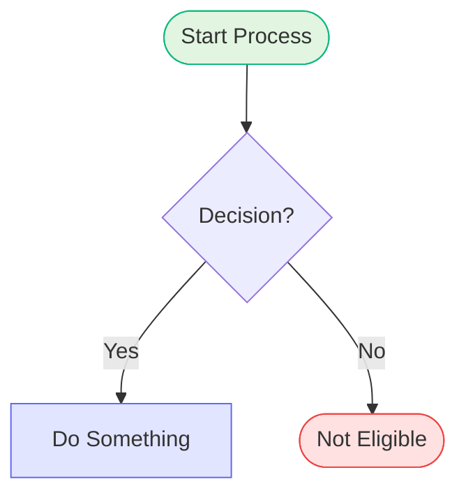
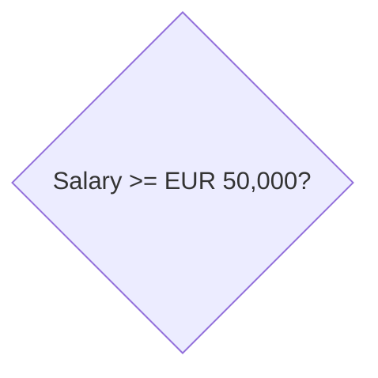
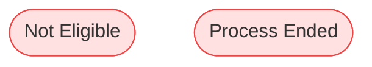
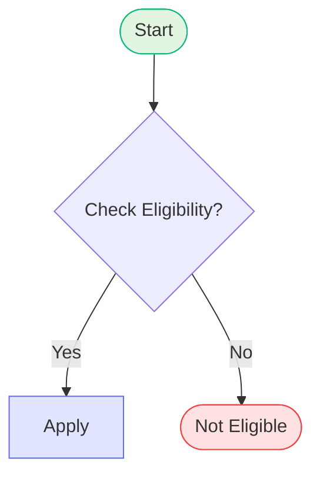
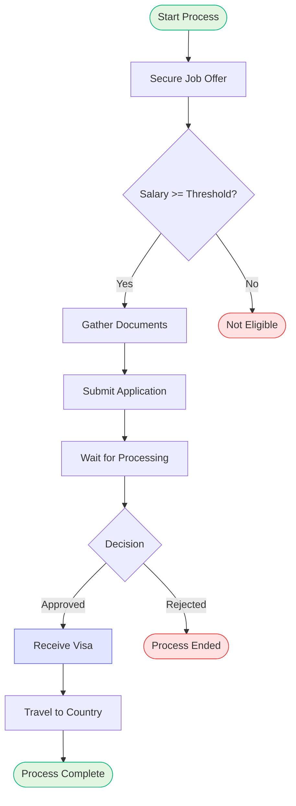

# Mermaid Flowchart Styling Guide

## Overview

This document explains how flowchart styling works in the Immigration Planning Tool. We use a **centralized styling approach** to reduce repetition and maintain consistency across all 135+ flowcharts.

## Styling Architecture

### 1. Global CSS Styles (`src/index.css`)

**Decision Nodes (Diamonds) - Automatic Yellow Styling**

All decision nodes are automatically styled with a flat yellow background (`#fff4cc`) and amber border (`#f59e0b`):

```css
.mermaid polygon {
  fill: #fff4cc !important;
  stroke: #f59e0b !important;
  stroke-width: 2px !important;
}
```

**Why this works:**
- In Mermaid flowcharts, decision nodes use curly braces `{}` syntax
- These are rendered as `<polygon>` SVG elements
- Polygons are ONLY used for diamond shapes in flowcharts
- This CSS automatically applies to ALL decision nodes across ALL flowcharts

**No manual styling needed!** Decision nodes are automatically yellow.

### 2. Per-Flowchart Style Commands

For other node types, use Mermaid's `style` command at the end of each diagram:



### 3. Centralized Configuration (`src/config/mermaid.config.ts`)

Global Mermaid configuration with theme variables:

```typescript
export const mermaidConfig: MermaidConfig = {
  theme: 'base',
  themeVariables: {
    primaryColor: '#e1e5ff',      // Light blue
    tertiaryColor: '#fff4cc',     // Flat yellow (decisions)
    successColor: '#e1f5e1',      // Light green
    errorColor: '#ffe1e1',        // Light red
    // ... more colors
  },
};
```

## Color Palette

| Node Type | Fill Color | Border Color | Usage |
|-----------|------------|--------------|-------|
| **Decision** | `#fff4cc` (Flat Yellow) | `#f59e0b` (Amber) | All decision points (automatic) |
| **Start/Success** | `#e1f5e1` (Light Green) | `#10b981` (Green) | Start and success nodes |
| **End/Error** | `#ffe1e1` (Light Red) | `#ef4444` (Red) | End and error nodes |
| **Important** | `#e1e5ff` (Light Blue) | `#6366f1` (Indigo) | Permits, visas, cards |
| **Warning** | `#fff4e1` (Light Orange) | `#f59e0b` (Orange) | Alternative outcomes |
| **Regular** | `#f3f4f6` (Light Gray) | `#9ca3af` (Gray) | Regular steps (default) |

## How to Style Flowcharts

### Decision Nodes (Diamonds)

**✅ DO THIS:**


**❌ DON'T DO THIS:**
```mermaid
flowchart TD
  check{Salary >= EUR 50,000?}
  
  style check fill:#fff4cc,stroke:#f59e0b  ← NOT NEEDED!
```

Decision nodes are **automatically yellow** via CSS. No manual styling required!

### Start/Success Nodes


### End/Error Nodes



### Important Nodes (Permits, Visas, Cards)


### Regular Steps

Regular steps use the default Mermaid styling (light gray). No `style` command needed.

## Migration Guide

### Before (Repetitive)

```mermaid
flowchart TD
  Start([Start]) --> check{Check Eligibility?}
  check -->|Yes| apply[Apply]
  check -->|No| End([Not Eligible])
  
  style Start fill:#e1f5e1,stroke:#10b981
  style End fill:#ffe1e1,stroke:#ef4444
  style check fill:#fff4cc,stroke:#f59e0b  ← Remove this!
  style apply fill:#e1e5ff,stroke:#6366f1
```

### After (Simplified)



**Decision node styling removed** - it's automatic!

## Benefits

1. **Consistency**: All decision nodes look the same across all flowcharts
2. **Less Code**: No need to manually style decision nodes
3. **Easier Maintenance**: Change decision node colors in one place (`src/index.css`)
4. **Reduced Errors**: Can't forget to style a decision node - it's automatic
5. **Cleaner Diagrams**: Less clutter in Mermaid diagram definitions

## Common Patterns

### Standard Immigration Flowchart



**Note:** `salary` and `decision` nodes are automatically yellow!

## Testing

To verify styling works correctly:

1. Run `npm run dev`
2. Navigate to `/all-flowcharts`
3. Check that all decision nodes (diamonds) are flat yellow
4. Verify other nodes use their specified colors

## Troubleshooting

**Q: Decision nodes aren't yellow**
- Check that `src/index.css` is loaded
- Verify browser cache is cleared
- Inspect SVG element - should have `<polygon>` with yellow fill

**Q: Can I override decision node color for a specific flowchart?**
- Not recommended - breaks consistency
- If absolutely necessary, use `!important` in inline style

**Q: What if I need a different color for a specific decision?**
- Consider if it's really a decision node or a different node type
- Use a different shape (rectangle, rounded rectangle) if it's not a true decision

## Future Improvements

Potential enhancements:

1. **Class-based styling**: Use Mermaid's `class` syntax for more flexibility
2. **Theme switching**: Support light/dark mode
3. **Custom node types**: Define reusable node styles
4. **Animation**: Add transitions for interactive elements

## References

- [Mermaid Flowchart Documentation](https://mermaid.js.org/syntax/flowchart.html)
- [Mermaid Theming](https://mermaid.js.org/config/theming.html)
- Color Palette: `src/config/mermaid.config.ts`

